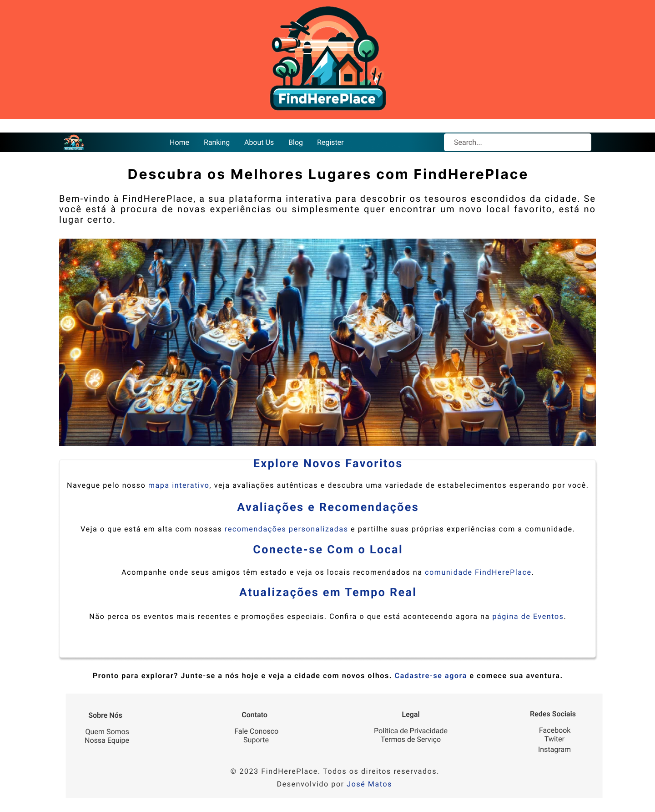

#
&nbsp;
&nbsp;


# Sobre o MVP
A aplicação consiste no projeto de conclusão da Sprint **Desenvolvimento Front-end Avançado** do Curso de **Desenvolvimento Full Stack** na PUC-Rio, e trata-se de uma aplicação WEB para lisagem dos 100 melhores restaurantes do Brasil. 

# Tecnologias
+ React
+ Figma
+ HTML5
+ CSS3
+ JavaScrip

# Como executar?

A aplicação está nesse repositório, sendo:
- Front-end (Este repositório)
- > [Vídeo de Visão Geral do Projeto] https://youtu.be/TBF7hzf91-k
- > [Protótipo do Projeto] https://www.figma.com/proto/VdDBdzSE98QY4fA7erlFK8/FINDHEREPLACE?page-id=0%3A1&type=design&node-id=8-27&viewport=471%2C442%2C0.22&t=dOy4kylRmClWd9pE-1&scaling=min-zoom&starting-point-node-id=8%3A27&mode=design

# 1. Instalação de Pré-Requisitos

Antes de começar, certifique-se de que tem o seguinte instalado:

+ Git: Para clonar o repositório do projeto.
+ Node.js e npm: O Node.js é o ambiente de execução para o JavaScript do lado do servidor e o npm é o gerenciador de pacotes para Node.js.

# 2. Clonagem do Repositório

+ 1. Clonar o Repositório: Abra um terminal no seu computador e digite:

```powershell
git clone https://github.com/mjosejunior/mvp_jrmj_sp3.git
```
+ 2. Instalar Dependências: Execute o comando:

```powershell
npm install
```
Isso instalará todas as dependências listadas no arquivo `package.json` do projeto.

# 3. Execução do Projeto

+ 1. Iniciar o Servidor de Desenvolvimento: 
Para esse Projeto React, você pode iniciar o servidor de desenvolvimento com:
```powershell
npm start
```
+ 2. Acessar a Aplicação: 
Após o servidor iniciar, a aplicação estará disponível em um navegador web, em:
```powershell
http://localhost:3000
```

Em caso de dificuldades, por favor, entre em contato.